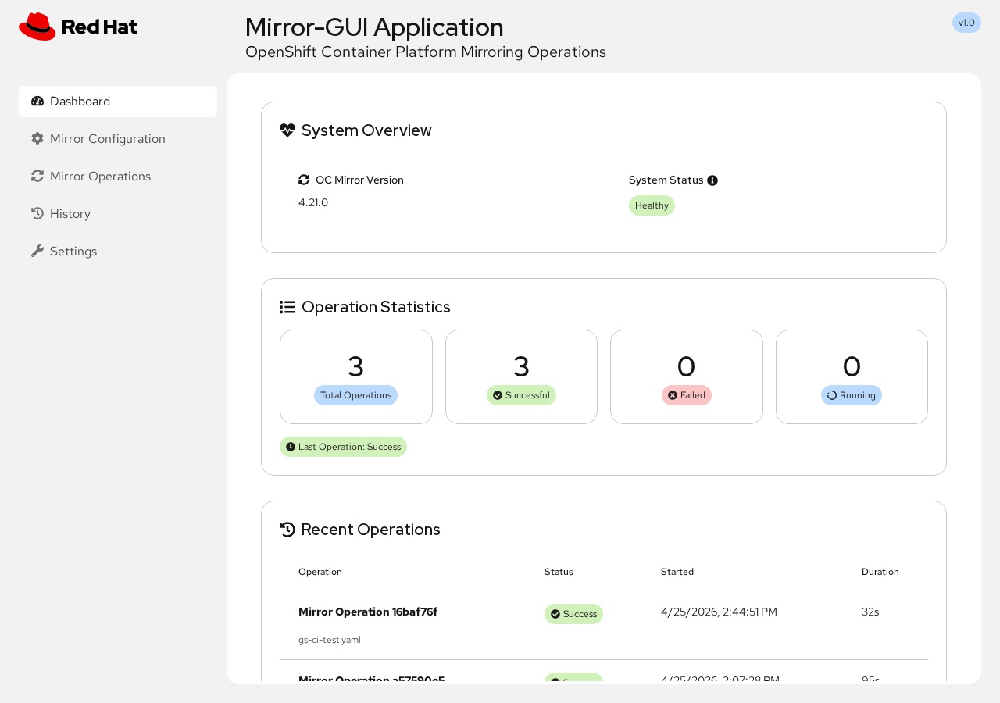
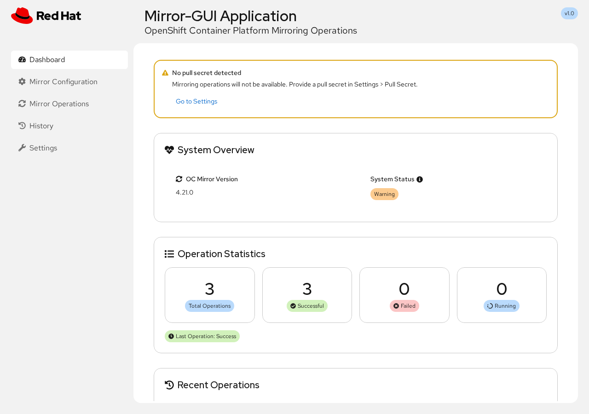
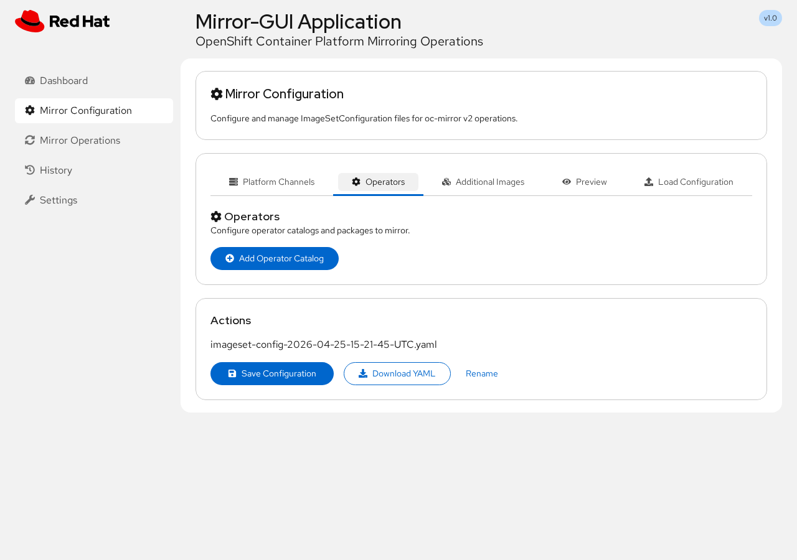
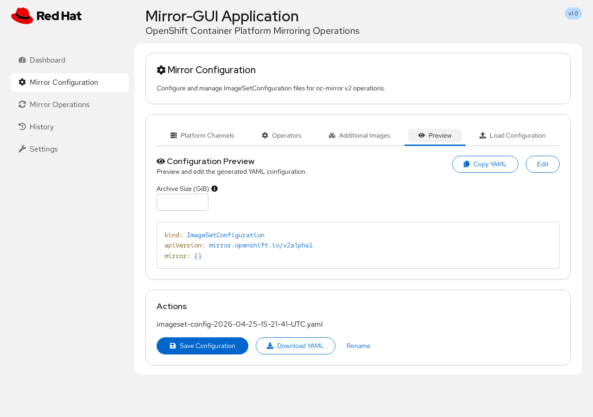
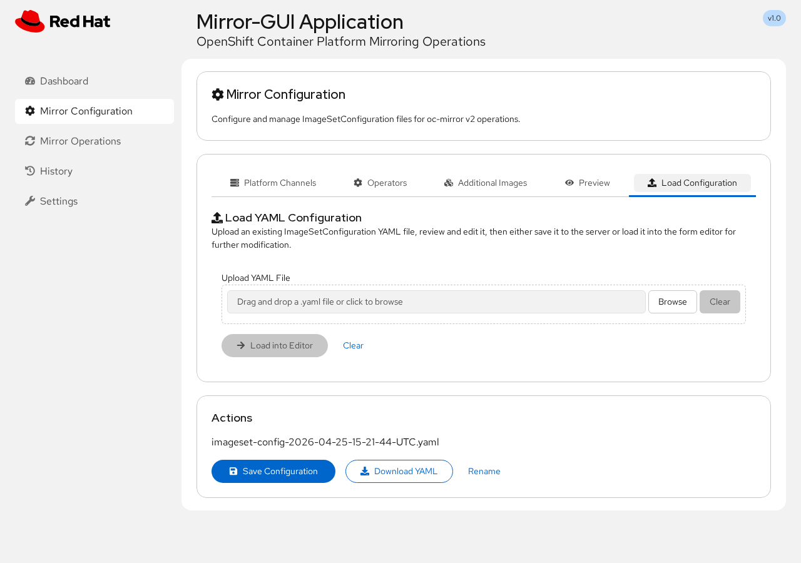
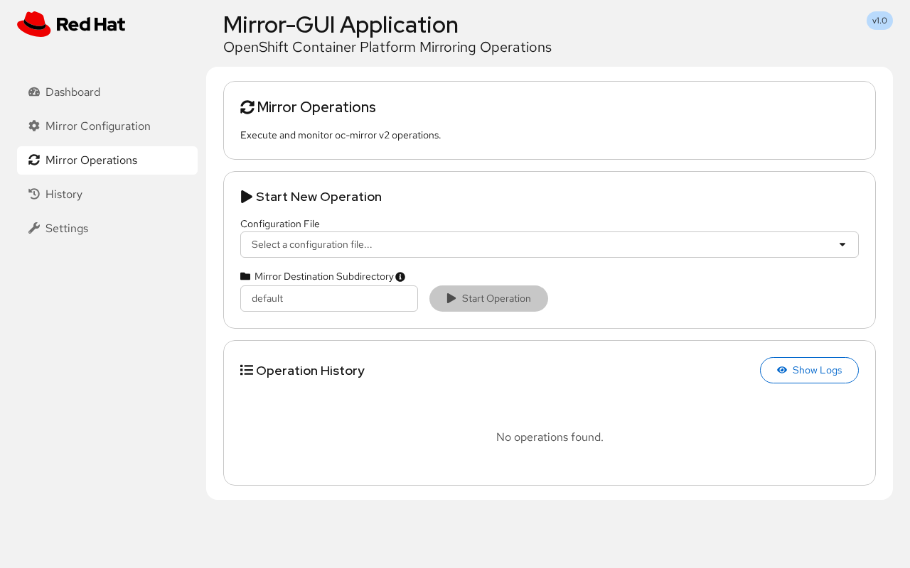
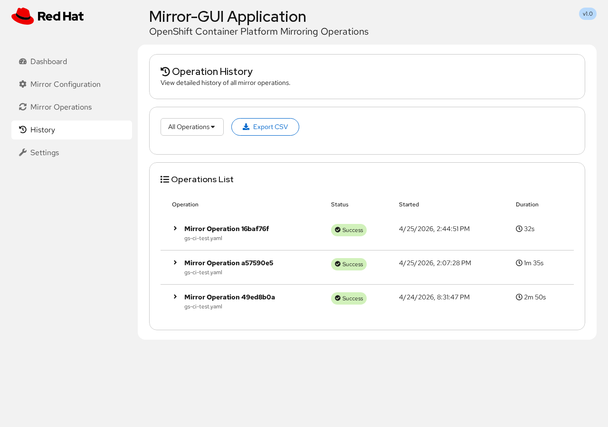
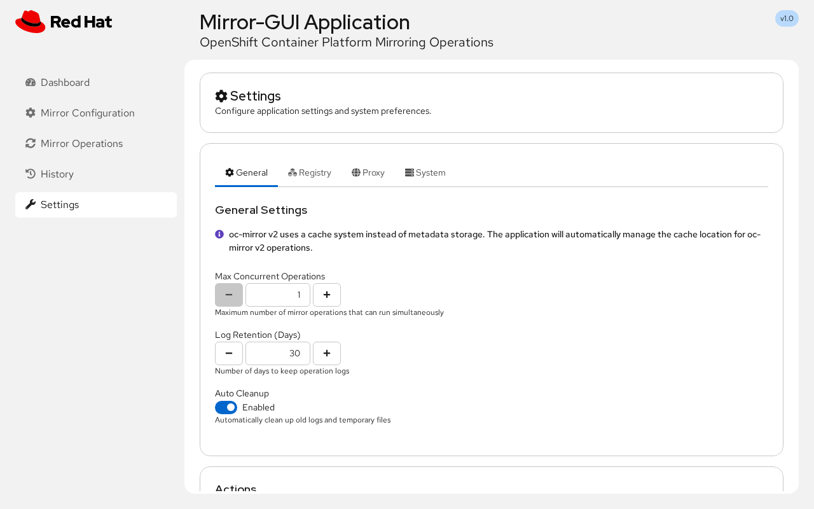

# Mirror-GUI Application

A modern web-based interface for managing OpenShift Container Platform mirroring operations using oc-mirror v2. Create, manage, and execute mirror configurations without command-line expertise.


---

## Quick Start

### Prerequisites

- **Podman** (required)
- **Pull secret** from [console.redhat.com](https://console.redhat.com/openshift/downloads#tool-pull-secret) (optional at startup — can be saved to `pull-secret/pull-secret.json` beforehand, or provided later via **Settings > Pull Secret** in the UI)

### Clone the repository

```bash
git clone https://github.com/openshift/mirror-gui.git
cd mirror-gui
```

### Option 1: Pre-built image (recommended)

```bash
chmod +x start-app.sh
./start-app.sh
```

The script auto-detects your architecture (AMD64/ARM64), pulls the image, and starts the app.
It will warn if `pull-secret/pull-secret.json` is missing but will still start. You can provide the pull secret later via **Settings > Pull Secret** in the UI.

To use a specific image (e.g. a CI-built image), pass it via `IMAGE_NAME`:

```bash
IMAGE_NAME=registry.ci.openshift.org/ocp/5.0:mirror-gui ./start-app.sh
```

You can also override the host port:

```bash
WEB_PORT=3002 ./start-app.sh
```

Open the URL printed by the script in your browser. By default it uses **http://localhost:3000**, but it automatically selects another free host port if `3000` is already in use. If a different port is chosen, use the `Web UI:` line printed by the script output.

Manage with: `./start-app.sh --stop`, `./start-app.sh --restart`, `./start-app.sh --status`, `./start-app.sh --logs`.

### Option 2: Build locally

```bash
chmod +x container-run.sh

# Build and run locally (fetches catalogs, builds image, starts container)
./container-run.sh

# Build only, without starting the container
./container-run.sh --build-only

# Run a previously built image without rebuilding or fetching catalogs
./container-run.sh --run-only
```

Every build path runs `fetch-catalogs-host.sh` to pull the latest Red Hat, Certified, and Community operator catalogs (OCP 4.16-4.21) before building the image. Use `--run-only` to skip fetching and building when you already have a local image.

Manage with: `./container-run.sh --stop`, `./container-run.sh --logs`, `./container-run.sh --status`.

---

## Features

### Dashboard

System status overview, operation statistics, recent operations, and quick action buttons. Shows a warning banner when no pull secret is detected.



**When no pull secret is detected**, a warning banner is displayed with a link to the Settings page where one can be uploaded.



### Mirror Configuration

Visual configuration builder with tabs for Platform Channels, Operators, Additional Images, YAML Preview, and file upload.

**Adding operators** -- Select from pre-fetched catalogs (OCP 4.16-4.21) with Red Hat, Certified, and Community operator indexes. Automatic dependency detection with one-click add.



**YAML preview and editing** -- Preview the generated `ImageSetConfiguration` YAML, copy to clipboard, or edit directly. Supports optional `archiveSize` parameter to limit archive file sizes.



**Upload existing YAML** -- Import existing `ImageSetConfiguration` files, review and edit them, then save to server or load into the form editor.



### Mirror Operations

Execute mirror operations with real-time monitoring. Select a configuration file, choose a destination subdirectory, and start. View operation history with logs, location info, and delete actions.



### History

Filter and review all past operations. Export to CSV.



### Settings

Configure general preferences, registry credentials, proxy settings, and system maintenance. The **Pull Secret** tab lets you view the current pull secret status and upload a new pull secret directly from the browser — no file system access required.



---

## Compatibility

| | |
|---|---|
| **oc-mirror** | v2 |
| **OpenShift** | 4.16, 4.17, 4.18, 4.19, 4.20, 4.21 |
| **Container runtime** | Podman 4.0+ |
| **Architecture** | AMD64 (x86_64), ARM64 (aarch64) |

---

## Troubleshooting

**"Failed to save configuration"** -- Fix directory permissions: `sudo chmod -R 755 data/`

**Invalid GPG signature for operator index images** -- See [Red Hat KB article](https://access.redhat.com/solutions/6542281).

---

## API

Full RESTful API documentation is available in [API.md](API.md).

## Contributing

1. Fork the repository
2. Create a feature branch
3. Make your changes and test
4. Submit a pull request

## License

Apache License 2.0 -- see [LICENSE](LICENSE) for details.

## Related Tools

For getting your first OpenShift cluster up in a disconnected environment, see the [ABA project](https://github.com/sjbylo/aba/).
